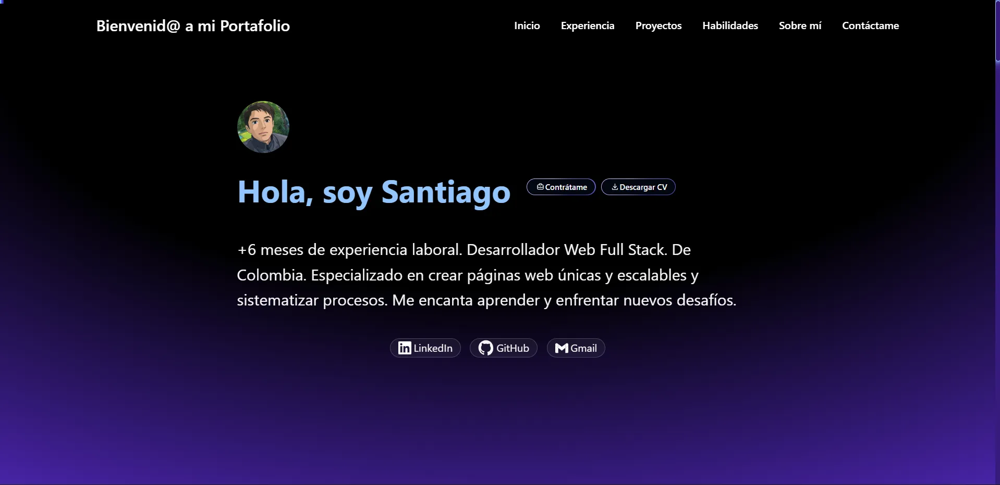

# Personal Portfolio - Santiago Rosero

Welcome to the repository of my personal portfolio!  
This project was created to showcase my skills, experience, and the projects I’ve worked on as a Full Stack Web Developer.

**[➡️ View Live Site](https://santiagorc-portfolio.vercel.app/)** <!-- Replace with your deployed site URL -->

<p align="center">
  
</p>

---

## 🚀 Main Features

* **Modern & Responsive Design:** Fully adaptable to mobile devices, tablets, and desktops, built with Tailwind CSS.  
* **Key Sections:** Includes sections for Experience, Projects, Skills, About Me, and Contact.  
* **Detailed Projects:** Each project includes a description, technologies used, and links to both the GitHub source code and the live site (when applicable).  
* **Skills Carousel:** An infinite, animated carousel displaying the technologies I master.  
* **Dark Theme:** Elegant dark interface with smooth gradients.  
* **Interactivity:** Hover effects in navigation and carousel, plus a progress bar that follows the user’s scroll.  

---

## 🛠️ Technologies Used

* **Framework:** [Astro](https://astro.build/) – For ultra-fast web performance.  
* **Styling:** [Tailwind CSS](https://tailwindcss.com/) – For rapid and customizable UI design.  
* **Languages:** HTML, CSS, JavaScript.  
* **Deployment:** Optimized for platforms such as Vercel or Netlify.  

---

## ⚙️ Getting Started

To run this project locally, follow these steps:

1. **Clone the repository:**
   ```bash
   git clone https://github.com/Xanty10RR/your-repository.git
   ```

2. **Navigate to the project directory:**
   ```bash
   cd your-repository
   ```

3. **Install dependencies:**
   ```bash
   npm install
   ```

4. **Start the development server:**
   ```bash
   npm run dev
   ```

Abre [http://localhost:4321](http://localhost:4321) en tu navegador para ver el resultado.

---

## 📬 Contact Me

I’d love to connect with you!

- 👨🏻‍💻[](https://www.linkedin.com/in/daniel-santiago-rosero-4420a91b0/)
- 📧 [](mailto:santiagocajamarca.37@gmail.com)
